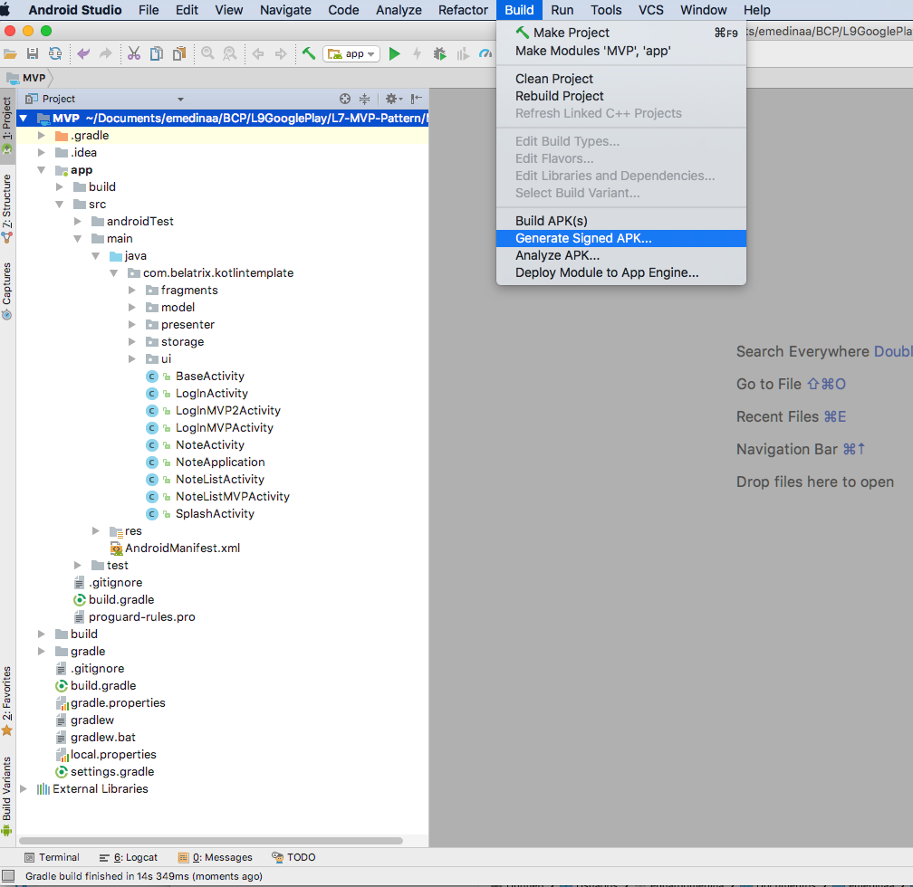
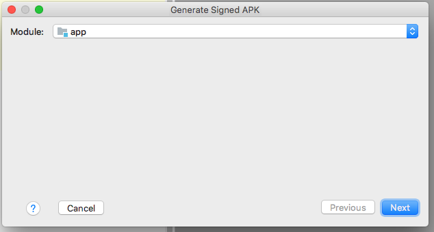
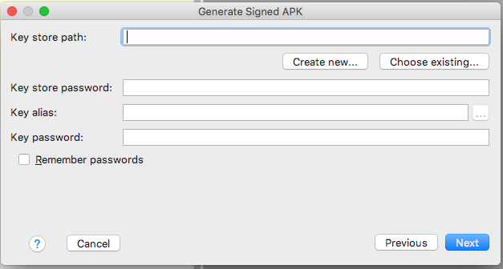
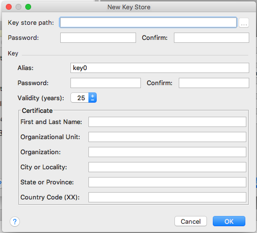
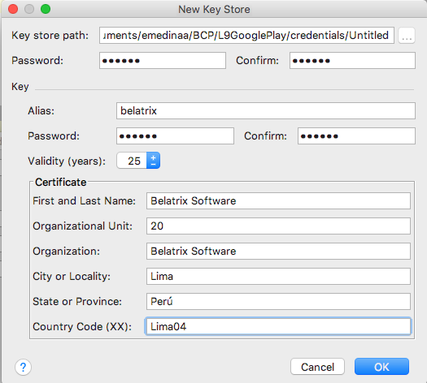
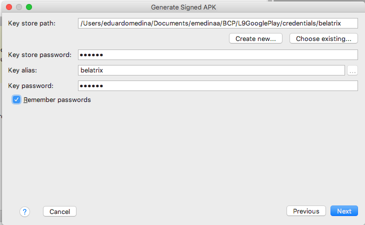
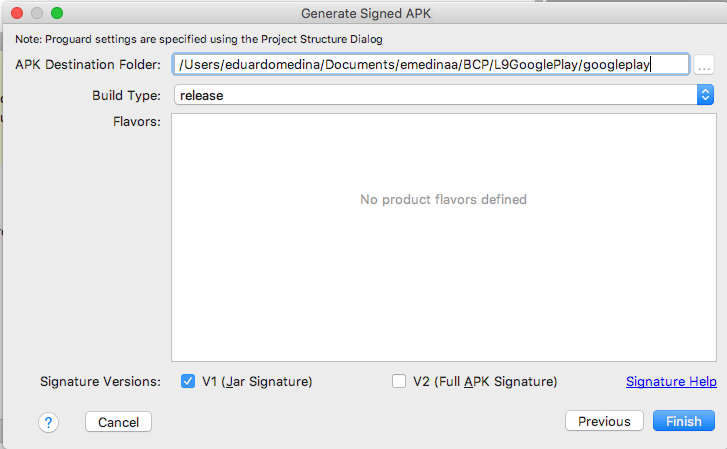
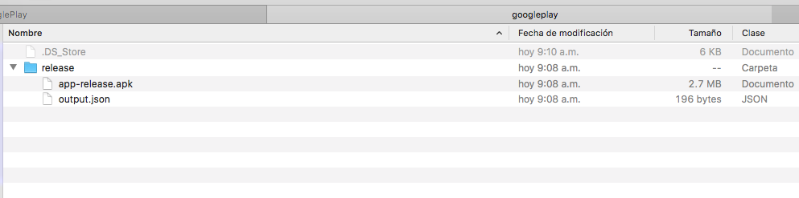
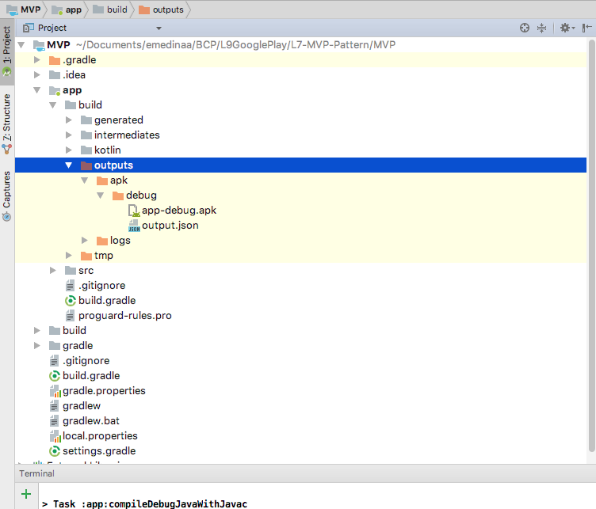

# Lesson 11 - Saturday, January 12

Curso de Aplicaciones Android con Kotlin (Básico - Intermedio) - Academia Móviles

# Slides


# Google Play

Lesson11 https://github.com/emedinaa/amoviles-kotlin-basic-intermediate/archive/Lesson11-GPlay.zip

## Lesson

- [x] Configurar proyecto
- [x] Firmar  App
- [x] Google Play Console
- [x] Publicar una app en google play

**Configurar proyecto**

*Configurar tu compilación* https://developer.android.com/studio/build/?hl=es-419

- Remover los Logs 

```java
public class LogUtils {
    public static void debug(final String tag, String message) {
        if (BuildConfig.DEBUG) {
            Log.d(tag, message);
        }
    }
}
```
- Parámetros , keys o credenciales pueden ser manejados con Gradle

Flavors

```groovy
android {
    defaultConfig {
        applicationId "com.example.myapp"
    }
    productFlavors {
        free {
            applicationIdSuffix ".free"
        }
        pro {
            applicationIdSuffix ".pro"
        }
    }
}
```

Manejo de keys y propiedades con Gradle

```groovy
...

// Create a variable called keystorePropertiesFile, and initialize it to your
// keystore.properties file, in the rootProject folder.
def keystorePropertiesFile = rootProject.file("keystore.properties")

// Initialize a new Properties() object called keystoreProperties.
def keystoreProperties = new Properties()

// Load your keystore.properties file into the keystoreProperties object.
keystoreProperties.load(new FileInputStream(keystorePropertiesFile))

android {
    ...
}
```

```groovy
android {
    signingConfigs {
        config {
            keyAlias keystoreProperties['keyAlias']
            keyPassword keystoreProperties['keyPassword']
            storeFile file(keystoreProperties['storeFile'])
            storePassword keystoreProperties['storePassword']
        }
    }
    ...
  }
```


- Application ID

```groovy
android {
    defaultConfig {
        applicationId "com.example.myapp"
        minSdkVersion 15
        targetSdkVersion 24
        versionCode 1
        versionName "1.0"
    }
    ...
}
```

- Activar ProGuard

*Reducir tu código y tus recursos* https://developer.android.com/studio/build/shrink-code?hl=es-419

*Proguard rules examples* https://medium.com/androiddevelopers/practical-proguard-rules-examples-5640a3907dc9

```groovy
android {
    buildTypes {
        release {
            minifyEnabled true
            proguardFiles getDefaultProguardFile('proguard-android.txt'),
                    'proguard-rules.pro'
        }
    }
    ...
}
```
Proguard rules :

```
# butterknife
-keep class butterknife.** { *; }
-dontwarn butterknife.internal.**
-keep class **$$ViewBinder { *; }

-keepclasseswithmembernames class * {
    @butterknife.* <fields>;
}

-keepclasseswithmembernames class * {
    @butterknife.* <methods>;
}

# retrofit
-dontwarn retrofit.**
-keep class retrofit.** { *; }
-keepattributes Signature
-keepattributes Exceptions

# okHttp3
-keepattributes Signature
-keepattributes *Annotation*
-keep class okhttp3.** { *; }
-keep interface okhttp3.** { *; }
-dontwarn okhttp3.**
-dontnote okhttp3.**

# okio
-keep class sun.misc.Unsafe { *; }
-dontwarn java.nio.file.*
-dontwarn org.codehaus.mojo.animal_sniffer.IgnoreJRERequirement

# gson

keep class sun.misc.Unsafe { *; }
-keep class com.google.gson.stream.** { *; }

```

- Generar APK de Debug

*Compilar tu proyecto desde línea de comandos* https://developer.android.com/studio/build/building-cmdline?hl=es-419

```java
gradlew assembleDebug
```

- Analizar APK

*Analizar tu compilación con APK Analyzer* https://developer.android.com/studio/build/apk-analyzer

Firma de aplicaciones desde Google Play


**Firmar App**

*Firmar tu aplicación* https://developer.android.com/studio/publish/app-signing?hl=es-419

Firma de aplicaciones desde Google Play


Administrar tu clave y keystore propios


Firma manual


- Generar una APK firmada







- Crear credenciales






- Crear APK







- Comandos

```
    ./gradlew assembleDebug

    ./gradlew installDebug
```




**Google Play**

*Google Play* https://developer.android.com/distribute/?hl=es-419

*Centro de Políticas de desarrolladores* https://play.google.com/about/developer-content-policy/#!?modal_active=none

*Academy for App Success* https://playacademy.exceedlms.com/student/catalog

*Cambios en Google Play consola 2018* https://android-developers.googleblog.com/2018/05/io-2018-everything-new-in-google-play.html

*SDK Developers* https://developer.android.com/distribute/google-play/sdk-developers?hl=es-419

- Ficha Google Play

Título (50)

Descripción breve (80)

Descripción completa (4000)

Recursos gráficos
    
> Captura de pantalla para teléfono (min 2)

> Icono de alta resolución 512x512

> Imagen destacada 1024x500

> Imagen promocional 180x120

Categorización

> Tipo de app y categoría

- Clasificación de Contenido

- Precio y distribución

- Version de la aplicación

    > Producción (Google play)

    > Beta (Google play)

    > Alfa

    > Prueba interna   

## Resources 

- Google Play console https://developer.android.com/distribute/console/

- Google Play Developer API https://developer.android.com/google/play/developer-api?hl=es-419

- Android Proguard https://developer.android.com/studio/build/shrink-code?hl=es-419

- Practical ProGuard rules samples https://medium.com/androiddevelopers/practical-proguard-rules-examples-5640a3907dc9

- ProGuard https://www.guardsquare.com/en/products/proguard

- Firmar tu App https://developer.android.com/studio/publish/app-signing?hl=es-419

- Publicar app https://developer.android.com/studio/publish/?hl=es-419

- Google Play console dashboard https://developer.android.com/distribute/console/index.html

- Google play console https://play.google.com/apps/publish/

- Build Your App from the Command Line https://developer.android.com/studio/build/building-cmdline.html

- Configure Build Variants https://developer.android.com/studio/build/build-variants.html

- App Privay Policy generator https://app-privacy-policy-generator.firebaseapp.com/

- Developer Policy Center https://play.google.com/about/developer-content-policy/#!?modal_active=none

- Google Play Developer API https://developers.google.com/android-publisher/

- Android Developers Blog https://android-developers.googleblog.com/2017/12/improving-app-security-and-performance.html

- CrashLytics https://fabric.io/kits/android/crashlytics

- Firebase Crash Reporting https://firebase.google.com/docs/crash/?hl=es-419

